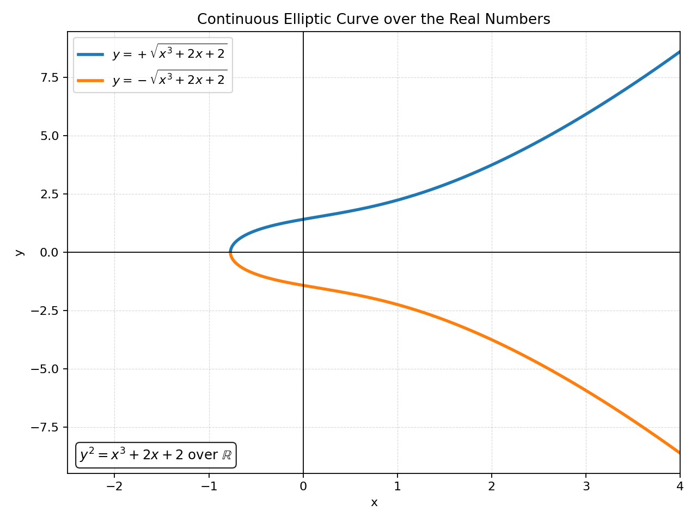
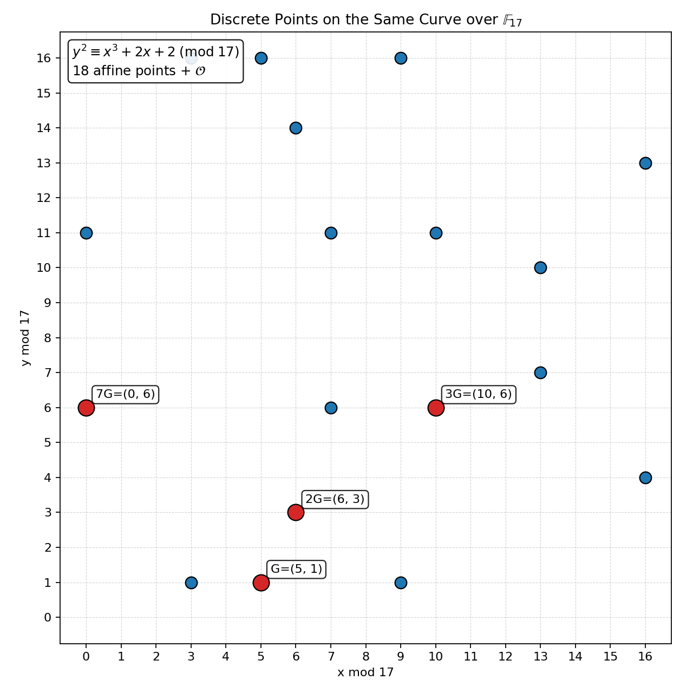
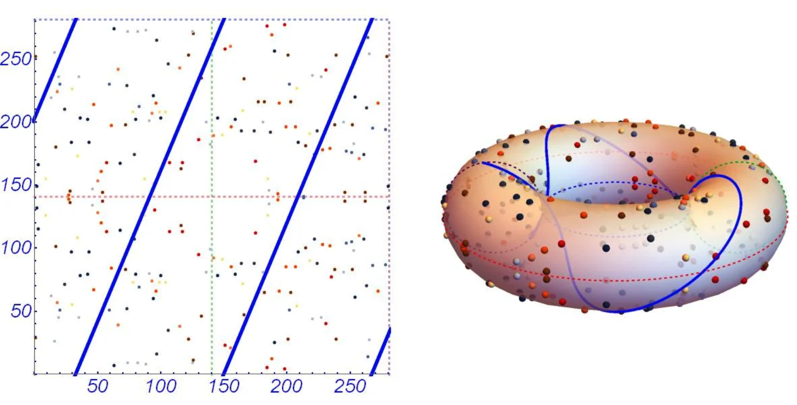
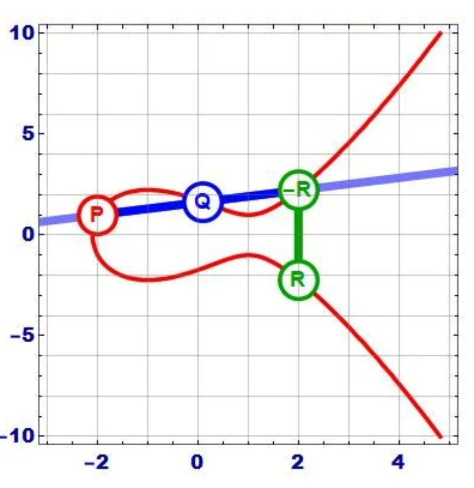
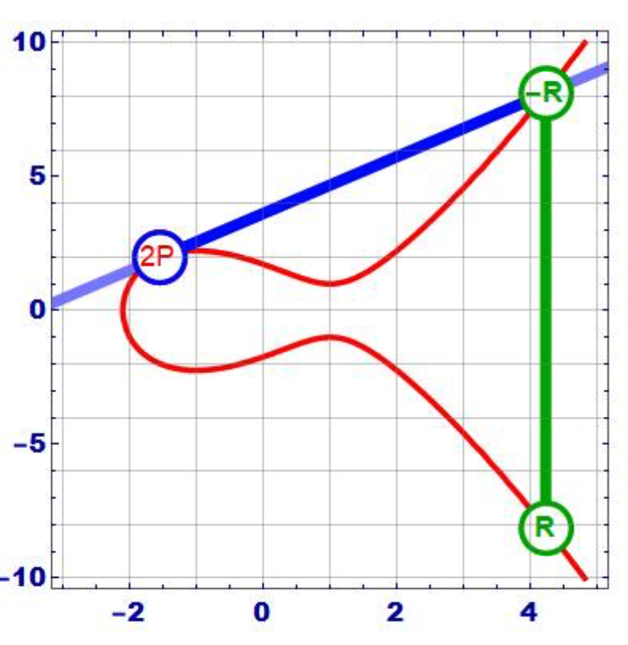

# Elliptic Curve Cryptography

Elliptic Curve Cryptography (ECC) is a form of public-key cryptography built from the arithmetic of points on elliptic curves. Like RSA, ECC creates a public key that can be safely shared and a private key that must remain secret. Unlike RSA, the hard problem is not integer factorization. The hard problem is finding how many times a starting point on an elliptic curve was added to itself.

ECC is widely used because it can provide strong security with relatively small keys. In practice, elliptic curves are often used to establish a shared secret, and that shared secret is then used to derive a symmetric encryption key for an algorithm such as AES-GCM.

---

## Elliptic Curves Over the Real Numbers

An elliptic curve is often written in the form below.

$$y^2 = x^3 + ax + b$$

Over the real numbers, this equation describes a set of ordered pairs $(x,y)$ that satisfy the equation. Mathematically using set builder notation, we can write the curve as the relation below.

$$E = \{(x,y) \in \mathbb{R}^2 : y^2 = x^3 + ax + b\}$$

Notice this is only a relation and not a function. A function cannot assign two different output values to the same input value. However, the elliptic curve equation contains $y^2$, so many values of $x$ can produce two values of $y$.

$$y = \pm \sqrt{x^3 + ax + b}$$

Notice this implies symmetry with respect to the x-axis. For example, if one point $(x,y)$ is on the curve, then the reflected point $(x,-y)$ is often also on the curve. This vertical symmetry is one reason elliptic curves are naturally described as sets of ordered pairs instead of functions.

The image below shows the common toy curve $y^2=x^3+2x+2$ over the real numbers.

To avoid curves with sharp cusps or self-intersections, the curve must be nonsingular. For the form $y^2 = x^3 + ax + b$, this means the discriminant condition below must hold.

$$4a^3 + 27b^2 \neq 0$$

The nonsingular condition is important because elliptic curve arithmetic depends on drawing lines through points and finding intersections. Singular curves do not have the same useful group structure.

### Deriving The Discriminant Condition (Nonsingularity Condition)

The expression $4a^3 + 27b^2$ comes from checking whether the curve has a singular point. A singular point is a point where the curve fails to be smooth. Visually, this could appear as a cusp, a sharp point, or a self-intersection.

Start with the elliptic curve equation below.

$$y^2 = x^3 + ax + b$$

Move everything to one side and define a two-variable equation.

$$F(x,y) = y^2 - x^3 - ax - b$$

A singular point occurs when the point is on the curve and both partial derivatives are zero.

$$F(x,y)=0$$

$$\frac{\partial F}{\partial x}=0$$

$$\frac{\partial F}{\partial y}=0$$

The partial derivatives are below.

$$\frac{\partial F}{\partial x} = -3x^2-a$$

$$\frac{\partial F}{\partial y} = 2y$$

The condition $\frac{\partial F}{\partial y}=0$ implies $y=0$. Substituting $y=0$ into the original equation gives the cubic equation below.

$$0 = x^3 + ax + b$$

The condition $\frac{\partial F}{\partial x}=0$ gives the equation below.

$$3x^2+a=0$$

This means a singular point occurs exactly when the cubic $f(x)=x^3+ax+b$ and its derivative $f'(x)=3x^2+a$ share a common root. In other words, the cubic has a repeated root.

Let the repeated root be $r$. Since $f'(r)=0$, we get the equation below.

$$3r^2+a=0$$

Solving for $a$ gives the following.

$$a=-3r^2$$

Since $r$ is also a root of the original cubic, $f(r)=0$.

$$r^3+ar+b=0$$

Substitute $a=-3r^2$.

$$
\begin{align*}
r^3+(-3r^2)r+b &= 0 \\
r^3-3r^3+b &= 0 \\
-2r^3+b &= 0
\end{align*}
$$

So,

$$b=2r^3$$

Now substitute $a=-3r^2$ and $b=2r^3$ into the expression $4a^3+27b^2$.

$$
\begin{align*}
4a^3+27b^2 &= 4(-3r^2)^3 + 27(2r^3)^2 \\
&= 4(-27r^6)+27(4r^6) \\
&= -108r^6+108r^6 \\
&= 0
\end{align*}
$$

Combining the above, a double implication (if and only if) has been proven. More specifically, if the curve has a singular point, then $4a^3+27b^2=0$. Conversely (other direction), if $4a^3+27b^2=0$, then the cubic $x^3+ax+b$ has a repeated root, which produces a singular point with $y=0$. Therefore, to make sure the curve is nonsingular, we require the opposite condition.

$$4a^3+27b^2 \neq 0$$

It is common to see the discriminant of the curve expressed as $\Delta=-16(4a^3+27b^2)$. Since multiplying by $-16$ does not change whether the value is zero over the real numbers, the nonsingular condition is often written simply as $4a^3+27b^2 \neq 0$.

Over a finite field $\mathbb{F}_p$, the same idea is used modulo $p$. For short Weierstrass curves of the form $y^2=x^3+ax+b$, assuming the field does not have characteristic 2 or 3, the condition becomes the congruence below.

$$4a^3+27b^2 \not\equiv 0 \pmod p$$

The characteristic of a field is the smallest number of times the multiplicative identity must be added to itself to produce the additive identity. For example, the characteristic of $\mathbb{F}_p$ is $p$.

---

## Elliptic Curves Over Finite Fields

The smooth curve over the real numbers is helpful for visualization, but cryptographic elliptic curves are not  implemented over $\mathbb{R}$. Instead, they are implemented over finite fields.

A common choice is the finite field $\mathbb{F}_p$, where $p$ is a prime number. The elements of $\mathbb{F}_p$ are the integers below.

$$\{0,1,2,\ldots,p-1\}$$

All arithmetic (multiplication and addition) operations are performed modulo $p$. The elliptic curve equation becomes the congruence below.

$$y^2 \equiv x^3 + ax + b \pmod p$$

The elliptic curve over $\mathbb{F}_p$ is the finite set of points below, together with a special identity point $\mathcal{O}$ called the point at infinity.

$$E(\mathbb{F}_p) = \{(x,y) \in \mathbb{F}_p^2 : y^2 \equiv x^3 + ax + b \pmod p\} \cup \{\mathcal{O}\}$$

Over the real numbers, the graph appears continuous. Over a finite field, the same equation produces a collection of separate points on a finite grid. For a small prime $p$, this can be drawn as a $p \times p$ grid.

Recall the toy curve $y^2=x^3+2x+2$ over the real numbers.

The image below shows the same toy curve equation over $\mathbb{F}_{17}$.

The fact that $\mathbb{F}_p$ is a field matters because division is defined for all elements other than the additive identity.  Specifically, division is effectively multiplying by multiplicative inverses. For example, the slope between two points usually has the form below.

$$m = \frac{y_2-y_1}{x_2-x_1}$$

In modular arithmetic, division by $x_2-x_1$ means multiplication by the inverse of $x_2-x_1$ modulo $p$.

$$m \equiv (y_2-y_1)(x_2-x_1)^{-1} \pmod p$$

A useful visualization is to imagine the finite grid wrapping around at the edges. If a line continues off one side of the grid, it reappears on the opposite side. If it moves beyond the top, it reappears from the bottom. In this sense, modular arithmetic preserves the idea of slope, but the line is drawn on a wrapped grid rather than an infinite plane.

One way to visualize this wrapping is to imagine gluing opposite sides of the square grid together with matching orientations. The result is a torus-like surface. The usual two-dimensional drawing is only a flat representation of this wrapped modular world.

The image below demonstrates a larger elliptic curve over a finite field.  Notice how the slope lines wrap around the torus and the edges of the grid.

---

## Elliptic Curve Point Addition

Elliptic curves become useful in cryptography because their points can be given a group operation. This operation is called point addition, but it is not ordinary coordinate-wise addition.

Suppose $P=(x_1,y_1)$ and $Q=(x_2,y_2)$ are two different points on the curve.

Graphically, the addition rule works as follows.

1. Draw the line through $P$ and $Q$.
2. The line intersects the elliptic curve at a third point.
3. Reflect that third point across the $x$-axis.
4. The reflected point is defined to be $P+Q$.

Over $\mathbb{F}_p$, the same rule is implemented with modular arithmetic. If $P \neq Q$ and $x_1 \not\equiv x_2 \pmod p$, calculate the slope below.

$$m \equiv (y_2-y_1)(x_2-x_1)^{-1} \pmod p$$

Then calculate the coordinates of $P+Q=(x_3,y_3)$.

$$x_3 \equiv m^2 - x_1 - x_2 \pmod p$$

$$y_3 \equiv m(x_1-x_3)-y_1 \pmod p$$

The formula already includes the reflection step. That is why the formula uses $m(x_1-x_3)-y_1$ for the new $y$-coordinate.

There is also a special identity point $\mathcal{O}$, called the point at infinity (point of singularity). It behaves like zero does under ordinary addition.

$$P + \mathcal{O} = P$$

$$\mathcal{O} + P = P$$

Every point also has an inverse. If $P=(x,y)$, then its inverse is the reflected point $-P=(x,-y)$ over the reals. Over $\mathbb{F}_p$, this is written as $-P=(x,-y \bmod p)$.

$$P + (-P) = \mathcal{O}$$

---

## Point Doubling

Point doubling is the case where a point is added to itself.

$$2P = P + P$$

Graphically, instead of drawing a line through two different points, we draw the tangent line at $P$. The tangent line intersects the curve at another point, and that point is reflected across the $x$-axis. The reflected point is defined to be $2P$.

If $P=(x_1,y_1)$, the doubling slope over $\mathbb{F}_p$ is below.

$$m \equiv (3x_1^2+a)(2y_1)^{-1} \pmod p$$

This can be derived from implicit differentiation of the elliptic curve equation shown below.

$$y^2=x^3+ax+b$$

Differentiate both sides with respect to $x$.

$$2y\frac{dy}{dx}=3x^2+a$$

Now solve for the derivative.

$$\frac{dy}{dx}=\frac{3x^2+a}{2y}$$

At the point $P=(x_1,y_1)$, the tangent slope is therefore below.

$$m=\frac{3x_1^2+a}{2y_1}$$

Over $\mathbb{F}_p$, this division is written using a multiplicative inverse.

$$m \equiv (3x_1^2+a)(2y_1)^{-1} \pmod p$$

This inverse exists when $2y_1 \not\equiv 0 \pmod p$.

Now we can calculate $2P=(x_3,y_3)$ with the formulas below.

$$x_3 \equiv m^2 - 2x_1 \pmod p$$

$$y_3 \equiv m(x_1-x_3)-y_1 \pmod p$$

If $2y_1 \equiv 0 \pmod p$, then the tangent line is vertical and $2P=\mathcal{O}$.

---

## Scalar Multiplication

In elliptic curve cryptography, expressions such as $2P$, $3P$, and $kP$ do not mean ordinary multiplication of coordinates. They mean repeated elliptic curve addition.

$$2P = P+P$$

$$3P = P+P+P$$

$$kP = \underbrace{P+P+\cdots+P}_{k \text{ times}}$$

The addition symbol has been overloaded. In this context, $P+Q$ means elliptic curve point addition which is draw the line, find the third intersection, and reflect. The expression $kP$ means repeatedly apply this special addition operation.

In real cryptographic systems, scalar multiplication is computed using efficient algorithms such as double-and-add. Even though the notation looks simple, computing $kP$ for a large scalar $k$ involves many point additions and point doublings.

---

## A Small Point Addition Example

Consider the toy elliptic curve below.

$$y^2 \equiv x^3 + 2x + 2 \pmod {17}$$

Let $G=(5,1)$. We will compute $2G$.

Since this is point doubling, the slope is below.

$$m \equiv (3x_1^2+a)(2y_1)^{-1} \pmod {17}$$

Substitute $x_1=5$, $y_1=1$, and $a=2$.

$$m \equiv (3(5)^2+2)(2(1))^{-1} \pmod {17}$$

$$m \equiv 77 \cdot 2^{-1} \pmod {17}$$

Since $77 \equiv 9 \pmod {17}$ and $2^{-1} \equiv 9 \pmod {17}$, the slope is below.

$$m \equiv 9 \cdot 9 \equiv 81 \equiv 13 \pmod {17}$$

Now calculate the new point.

$$x_3 \equiv 13^2 - 2(5) \equiv 169 - 10 \equiv 159 \equiv 6 \pmod {17}$$

$$y_3 \equiv 13(5-6)-1 \equiv -14 \equiv 3 \pmod {17}$$

Therefore,

$$2G = (6,3)$$

This example is intentionally small enough to compute by hand. Real curves use much larger primes.

---

## The Discrete Logarithm Problem

The strength of ECC is related to the ordinary discrete logarithm problem.

In modular arithmetic, it is usually easy to compute a value like the one below.

$$h \equiv g^x \pmod p$$

If $g$, $x$, and $p$ are known, then $h$ can be computed efficiently. The reverse problem is much harder. If $g$, $h$, and $p$ are known, find the exponent $x$ such that the following congruence is true.

$$g^x \equiv h \pmod p$$

This is called the discrete logarithm problem. "What exponent produced this result?"

Elliptic curve cryptography uses a related problem. Suppose $G$ is a known base point on an elliptic curve and $Q$ is another known point.

$$Q = kG$$

If $k$ and $G$ are known, then $Q$ can be computed efficiently using scalar multiplication. The hard problem is reversing this process. Given $G$ and $Q$, find $k$.

This is called the elliptic curve discrete logarithm problem. The security of ECC depends on the fact the discrete logarithm problem is believed to be computationally infeasible for properly selected curves and sufficiently large parameters.

---

## Alice and Bob Using Elliptic Curves to Encrypt Data

Elliptic curves are commonly used to establish a shared secret. That shared secret is then passed through a key derivation function to produce a symmetric encryption key. The actual message is usually encrypted with a symmetric authenticated encryption algorithm such as AES-GCM.

This type of construction is often called a hybrid encryption scheme. Elliptic curves solve the key establishment problem, and symmetric encryption handles the bulk message encryption.

Suppose Bob wants people to be able to send him encrypted messages.

### Bob Creates a Public Key

1. Bob selects a standard elliptic curve and a public base point $G$.
2. Bob chooses a private key $d_B$.
3. Bob computes his public key.

$$Q_B = d_B G$$

Bob publishes $Q_B$ and keeps $d_B$ secret.

### Alice Encrypts a Message to Bob

1. Alice obtains Bob's public key $Q_B$.
2. Alice chooses a new random ephemeral private value $k$.
3. Alice computes an ephemeral public point.

$$R = kG$$

4. Alice computes the shared secret point.

$$S = kQ_B$$

5. Alice uses the $x$-coordinate of $S$, along with a key derivation function, to derive a symmetric key.
6. Alice encrypts the message with an authenticated symmetric encryption algorithm such as AES-GCM.
7. Alice sends Bob the ephemeral public point $R$, the ciphertext, and the data needed for authenticated decryption, such as a nonce and authentication tag.

### Bob Decrypts the Message

1. Bob receives $R$ and the encrypted message.
2. Bob computes the shared secret point using his private key.

$$S' = d_B R$$

3. Since $R=kG$, Bob's computation becomes the expression below.

$$S' = d_B(kG)$$

4. Since $Q_B=d_B G$, Alice's shared secret was the following.

$$S = kQ_B = k(d_B G)$$

Both sides produce the same elliptic curve point.

$$d_B(kG) = k(d_BG)$$

So Bob derives the same symmetric key and decrypts the message.

Notice this relies on the commutativity of scalar multiplication.

---

## Toy Alice and Bob Example

The following example is intentionally tiny and is not secure. It is only used to show the arithmetic.

Use the curve below.

$$y^2 \equiv x^3 + 2x + 2 \pmod {17}$$

Let the base point be $G=(5,1)$.

### Bob's Key Pair

Bob chooses private key $d_B=7$.

Bob computes his public key.

$$Q_B = 7G = (0,6)$$

Bob publishes $Q_B=(0,6)$.

### Alice's Ephemeral Key

Alice chooses ephemeral private value $k=3$.

Alice computes the ephemeral public point.

$$R = 3G = (10,6)$$

Alice computes the shared secret.

$$S = 3Q_B = 3(0,6) = (6,3)$$

For this toy example, suppose Alice derives the symmetric key from the $x$-coordinate, so $K=6$.

If Alice wants to send the small message $m=13$, we can demonstrate encryption with a simple modular shift. This is not secure encryption; it is only a placeholder for a real symmetric cipher.

$$c \equiv m + K \equiv 13 + 6 \equiv 19 \equiv 2 \pmod {17}$$

Alice sends $R=(10,6)$ and $c=2$ to Bob.

### Bob Recovers the Same Secret

Bob computes the shared secret using his private key and Alice's ephemeral public point.

$$S' = 7R = 7(10,6) = (6,3)$$

Bob derives the same toy key $K=6$ and decrypts.

$$m \equiv c - K \equiv 2 - 6 \equiv -4 \equiv 13 \pmod {17}$$

Bob recovers the original message $m=13$.

In a real system, Alice would not use a modular shift. She would use a key derivation function and an authenticated encryption algorithm such as AES-GCM or ChaCha20-Poly1305.

---

## NIST-Approved Elliptic Curves

NIST publishes approved elliptic curve domain parameters for federal cryptographic use. Modern systems most commonly use prime-field curves, where the field is $\mathbb{F}_p$ for a large prime $p$.

Common NIST prime-field curves include the following.

- **NIST P-224**, also known as `secp224r1`: a 224-bit prime-field curve. It provides less security than P-256 and is less common in new systems.
- **NIST P-256**, also known as `secp256r1` or `prime256v1`: a 256-bit prime-field curve. This is one of the most widely deployed elliptic curves and is common in TLS, certificates, and general public-key cryptography.
- **NIST P-384**, also known as `secp384r1`: a 384-bit prime-field curve. It is commonly used when a higher security level is desired.
- **NIST P-521**, also known as `secp521r1`: a 521-bit prime-field curve. The number 521 is prime, which is why the curve is named P-521 instead of P-512.

NIST has also published binary-field curves. These are defined over fields of the form $\mathbb{F}_{2^m}$ rather than $\mathbb{F}_p$.

- **NIST K-233, K-283, K-409, and K-571**: binary Koblitz curves.
- **NIST B-233, B-283, B-409, and B-571**: binary curves generated with pseudorandom parameters.

Although binary-field curves exist in NIST publications, modern general-purpose software most often uses prime-field curves such as P-256, P-384, and P-521.

There are also widely used non-NIST curves, such as Curve25519 for X25519 key exchange. Curve25519 is extremely common in modern protocols, but it is not one of the traditional NIST P-curves.

---

## Summary

Elliptic curves over the real numbers form relations of ordered pairs, not usually functions. Over finite fields, the same type of equation becomes a finite set of points with arithmetic performed modulo a prime.

ECC depends on a special point addition operation. Adding two points means drawing a line through them, finding the third intersection, and reflecting. Doubling a point uses a tangent line. Scalar multiplication such as $kG$ means repeated elliptic curve addition.

The security of ECC is based on the elliptic curve discrete logarithm problem. Given $G$ and $Q=kG$, it is believed to be very hard to recover $k$ when the curve and parameters are properly chosen.

In practice, elliptic curves are usually used to establish a shared secret. That shared secret is then used to derive a symmetric encryption key, allowing Alice and Bob to communicate securely using authenticated encryption.

---

## References

- [NIST FIPS 186-5: Digital Signature Standard](https://csrc.nist.gov/pubs/fips/186-5/final)
- [NIST SP 800-186: Recommendations for Discrete Logarithm-Based Cryptography: Elliptic Curve Domain Parameters](https://csrc.nist.gov/pubs/sp/800/186/final)
- [SECG SEC 2: Recommended Elliptic Curve Domain Parameters](https://www.secg.org/sec2-v2.pdf)
- [RFC 6090: Fundamental Elliptic Curve Cryptography Algorithms](https://datatracker.ietf.org/doc/html/rfc6090)
- [RFC 7748: Elliptic Curves for Security](https://datatracker.ietf.org/doc/html/rfc7748)
